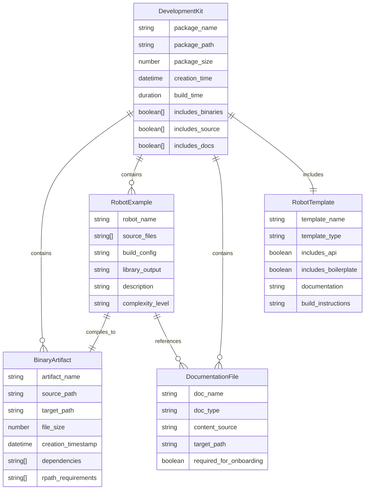

# Data Model: Developer Package Creator

## Core Entities

### DevelopmentKit Package
**Description**: Self-contained archive with everything needed for robot development
**Fields**:
- package_name: string (e.g., "robot-dev-kit.tar.gz")
- package_path: string (absolute path to generated archive)
- package_size: number (bytes, must be <50MB)
- creation_time: datetime
- build_time: duration (must be <5 minutes)
- includes_binaries: boolean[]
- includes_source: boolean[]
- includes_docs: boolean

### BinaryArtifact
**Description**: Pre-compiled components included in the package
**Fields**:
- artifact_name: string (robot-arena, librunner.so, libscanner.so)
- source_path: string (relative path in build directory)
- target_path: string (path within package)
- file_size: number
- creation_timestamp: datetime
- dependencies: string[] (shared library dependencies)
- rpath_requirements: string[]

### RobotExample
**Description**: Complete robot implementations for learning and testing
**Fields**:
- robot_name: string (Runner, Scanner)
- source_files: string[] (.cpp, .h files)
- build_config: string (CMakeLists.txt content)
- library_output: string (corresponding .so file)
- description: string
- complexity_level: enum (basic, intermediate, advanced)

### DocumentationFile
**Description**: Developer guidance and instructional content
**Fields**:
- doc_name: string (README.md, ROBOT_RULES.md)
- doc_type: enum (quickstart, rules, reference)
- content_source: string (file path in repo)
- target_path: string (path within package)
- required_for_onboarding: boolean

### RobotTemplate
**Description**: Starting point for new robot development
**Fields**:
- template_name: string (MyRobot.cpp)
- template_type: string (C++ robot template)
- includes_api: boolean (includes Robot.h)
- includes_boilerplate: boolean (basic class structure)
- documentation: string (embedded comments)
- build_instructions: string

## Relationships



## Validation Rules

### DevelopmentKit Validation
- package_name must follow pattern: robot-dev-kit-*.tar.gz
- package_size must be < 50MB (52,428,800 bytes)
- build_time must be < 300 seconds (5 minutes)
- includes_binaries must contain all required artifacts
- includes_source must contain both Runner and Scanner
- includes_docs must contain README and template

### BinaryArtifact Validation
- artifact_name must be in whitelist: [robot-arena, librunner.so, libscanner.so]
- source_path must exist and be executable (for robot-arena)
- file_size must be > 0 and reasonable for component type
- dependencies must be resolvable on target system

### RobotExample Validation
- robot_name must match existing directory in Robots/
- source_files must all exist and be readable
- build_config must be valid CMakeLists.txt
- complexity_level must be one of: basic, intermediate, advanced

### DocumentationFile Validation
- doc_name must be unique within package
- doc_type must be valid category
- content_source must exist in repository
- required_for_onboarding must be true for README.md

## State Transitions

### Package Creation Flow
```
INIT → CHECK_BUILD_STATUS → [BUILD_NEEDED] → BUILD_ARTIFACTS → COLLECT_FILES → CREATE_PACKAGE → VALIDATE_PACKAGE → COMPLETE
       ↓                      [BUILD_UP_TO_DATE]       ↓
       ↓                                               ↓
       └────────────────→ COLLECT_FILES ──────────────┘
```

### Build Status States
- INIT: Script starting
- CHECK_BUILD_STATUS: Verifying existing artifacts
- BUILD_NEEDED: Missing or outdated artifacts detected
- BUILD_UP_TO_DATE: All artifacts current
- BUILD_ARTIFACTS: Running CMake build process
- COLLECT_FILES: Gathering package contents
- CREATE_PACKAGE: Creating tar.gz archive
- VALIDATE_PACKAGE: Verifying package integrity
- COMPLETE: Package ready for distribution

## Error Conditions

### Build System Errors
- Build directory missing and creation fails
- CMake configuration fails
- Compilation errors during build
- Insufficient disk space for build
- Permission denied for build operations

### Package Creation Errors
- Required source files missing from repository
- Documentation templates not found
- Binary artifacts missing after build
- Insufficient disk space for package creation
- Permission denied for file operations

### Validation Errors
- Package size exceeds limit
- Required content missing from package
- Binary dependencies not satisfied
- Generated package corrupted or unreadable
- RPATH settings incorrect for portability